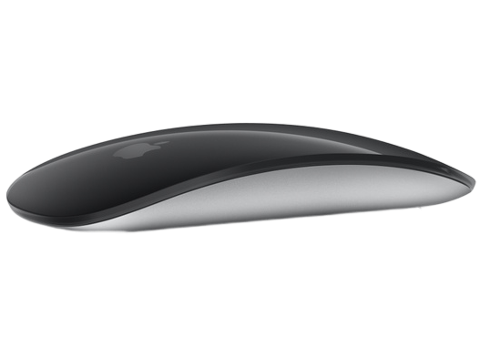
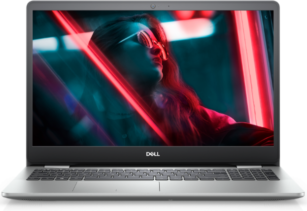
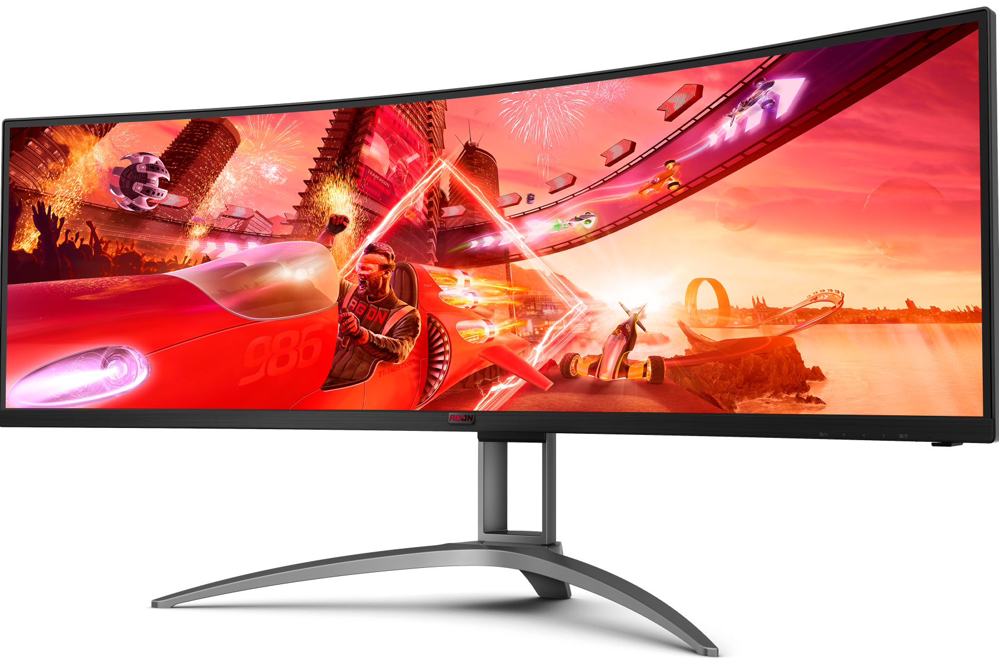

#  <h1 aling="center">produtod_git</h1>

# descrição do projeto
* Fizemos um site usando html e CSS, o site que eu fiz e um site de venda de produtos gamer com varios com acessorio entre eles um :
* Magic Mouse – Superfície Multi-Touch preta

* Notebook Dell Inspiron 15 3000 Intel Core i5 - 8GB 256GB SSD 15,6” Full HD Windows 11

* Monitor Gamer UltraWide LG 26WQ500-B 25,7” - Full HD 75Hz IPS 1ms HDMI FreeSync

* Teclado Mecânico Gamer HyperX Alloy Origins Core, RGB - HX-KB7RDX-BR

# tecnologias ultilizados
* eu ultilizei HTML,CSS

# Funcionalidade 
 
 * um site de produtos eletronicos com varios acessorios de informatica e etc... 

